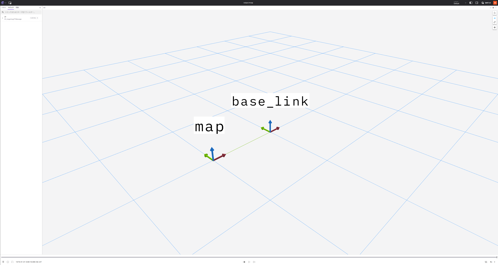

# TF

TF import tool can write tf2_amber.TransformStamped python object to mcap file as [`tf2_msgs/msg/TFMessage` in ROS 2.](https://docs.ros2.org/foxy/api/tf2_msgs/msg/TFMessage.html)

## How to use

```python
config = TfImporterConfig()
config.rosbag_path = "output.mcap" # Path to output mcap rosbag file.
importer = TfImporter(config)
sample_data = TransformStamped()
sample_data.child_frame_id = "base_link"
sample_data.header.frame_id = "map"
sample_data.header.stamp.nanosec = 0
sample_data.header.stamp.sec = 0
sample_data.transform.translation.x = 1
importer.write(sample_data)
sample_data.header.stamp.sec = 10
importer.write(sample_data)
importer.finish()
```

Then, run `ros2 bag info output.mcap`

```bash

closing.

Files:             tests/output.mcap
Bag size:          4.0 KiB
Storage id:        mcap
Duration:          10.000000000s
Start:             Jan  1 1970 09:00:00.000000000 (0.000000000)
End:               Jan  1 1970 09:00:10.000000000 (10.000000000)
Messages:          2
Topic information: Topic: /tf | Type: tf2_msgs/msg/TFMessage | Count: 2 | Serialization Format: cdr
```

## View rosbag data in foxglove


