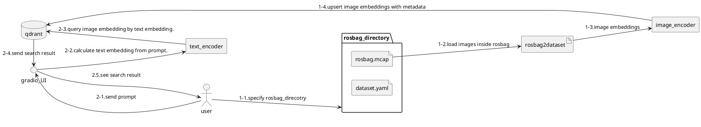

# Image Search

This application compares the image embedding calculated from the images in the rosbag with the text embedding calculated from the prompts entered by the user using various Vision&Language models, and presents the closest result as the search result.

This application uses [qdrant](https://qdrant.tech/), a type of vector search engine, for searching.



1-* shows the processing steps up to the point where the embedding of the image is calculated and it is registered in qdrant.
2-* indicates the point where prompt input is accepted and displayed.

## Run application with ford dataset.

!!! warning
    This sample command is written with the assumption that it will be executed in the root directory of the amber package.

```bash
python3 amber/apps/image_search.py --rosbag_directory tests/rosbag/ford/ --sampling_duration=0.1
```

If it works correctly, the following message is displayed.

```
Running on local URL:  http://127.0.0.1:7860

To create a public link, set `share=True` in `launch()`.
```

Please access [this URL](http://127.0.0.1:7860) as soon as the message is confirmed.

You can search for images by entering a prompt in gradio's UI as shown in the video below.

<iframe width="560" height="315" src="https://www.youtube.com/embed/ryp29wm46TQ?si=ZDRpYwQRO09ogdMZ" title="YouTube video player" frameborder="0" allow="accelerometer; autoplay; clipboard-write; encrypted-media; gyroscope; picture-in-picture; web-share" allowfullscreen></iframe>
