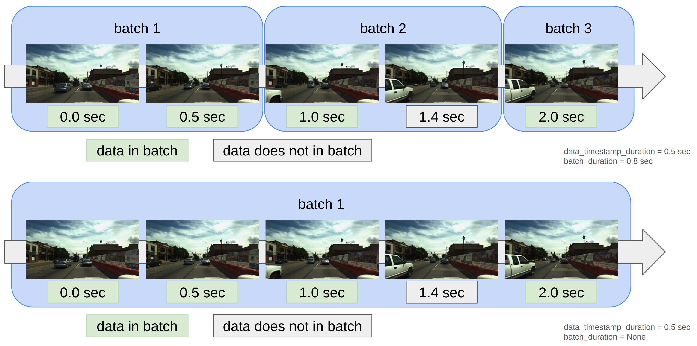
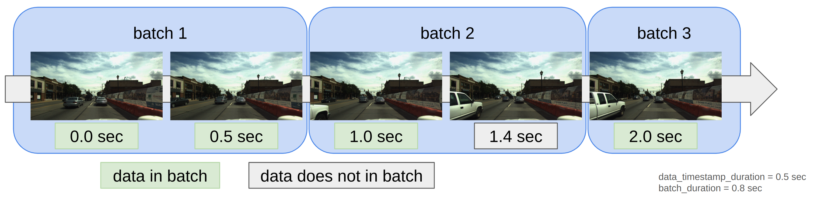

# TimestampSampler

## Description

TimeStampSampler is a type of BatchSampler.
This sampler has the ability to sample data at a fixed time interval and to create batches of data at fixed time intervals.

TimeStampSampler can be used in combination with rosbag dataset as follows.

!!! warning
    TimeStampSampler creates batches using timestamps recorded in rosbag, so cannot be used with common data sets.

```python
dataloader_batched = torch.utils.data.DataLoader(
    dataset,
    batch_sampler=TimestampSampler(
        dataset, Time(1, TimeUnit.SECOND), Time(5, TimeUnit.SECOND)
    ),
)
for i_batch, sample_batched in enumerate(dataloader_batched):
    pass
```

The first argument given to the constructor of TimeStampSampler is the dataset, the second argument is how many seconds of data to sample, and the third argument is how many seconds to create a batch.

The behavior of the second and third arguments is shown in the figure below.



If None is passed as the third argument, TimeStampSampler will sample all data and create one large batch.

First, the first data is left in the batch, and the data until the time specified in the second argument has elapsed is removed from the batch.

If the data for which the time specified in the second argument has elapsed is confirmed, the data from that time until the time specified in the second argument has elapsed is removed from the batch.

The above operation is performed until the last data is reached.

## Example



Let's take the case where data_timestamp_duration = 0.5sec and batch_duration = 0.8sec as an example

Decompose the recorded data from the timestamps [0.0, 0.5, 1.0, 1.4, 2.0] into batches of 0.8sec each.

[0.0, 0.5], [1.0, 1.4], [2.0].

Compute the time difference for the data inside each decomposed batch.

For [0.0, 0.5], since more than 0.5 seconds have passed since the first data (0.0 seconds), both data remain in the batch.

For [1.0, 1.4], only the first data remains in the batch because only 0.4 seconds have elapsed since the first data (1.0 seconds).

For [2.0], there is only one data in the batch, so only the first data remains.
